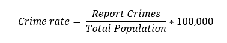
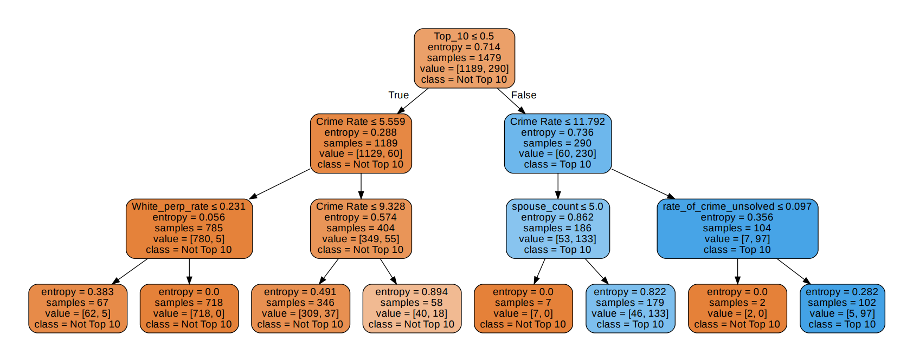
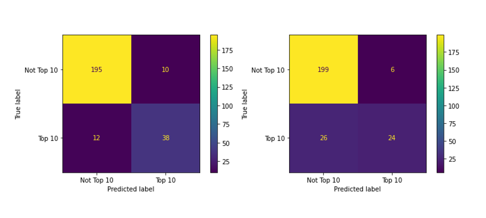

# Homicide Reports

## Introduction

## Data and Data Cleaning

The original dataset was based on homicide reports from 1980-2014 from Kaggle. (<a href="https://www.kaggle.com/murderaccountability/homicide-reports"> Link to Kaggle Dataset </a> ) This dataset had 24 total columns listed below and each row detailed a homicide including information such as victim and perpetrator descriptions (i.e. age, race, ethnicity) and details about the murder itself (solved status, weapon type, location). While the Kaggle forum proposed interesting questions about predicting serial killers, our team wanted to take a more broad look at the state murder rates, so a lot of cleaning and synthesizing of the data needed to be done. 

| Categorical Columns  | Numeric Columns |
| ------------- | ------------- |
| Agency Code*  | Incident* |
| Agency Name*  | Victim Age |
| Agency Type | Perpetrator Age  |
|City | Victim Count  |
| State  | Perpetrator Count  |
| Year  |   |
| Month  |   |
| Crime Type  |   |
| Crime Solved  |   |
| Victim Sex |   |
| Victim Race  |   |
| Victim Ethinicity  |  |
| Perpetrator Sex|   |
| Perpetrator Race  |   |
| Perpetrator Ethincity  |   |
| Relationship  |   |
| Weapon  |   |
| Record Source |  |

The dataset was reorganized such that each row was a yearly summary for a singular state. The columns from the original dataset, excluding those with an asterisk , were cleaned to create summary statistics for a given state each year. A total crime count and total city with crime count were the first two values calculated.  For any categorical columns, a rate and count were calculated for each of the possible values of the column. Rates were calculated by dividing the count for a given value by the total crime count for that row. Relationships were ultimately grouped into more general relationship types to help reduce the total number of columns. Those groupings can be seen in the table below. For any numeric columns, the minimum, maximum, and average value was calculated. While this dataset was quite clean, any numeric values that were unknown were set to 0, thus skewing any of the numeric values. 

| New Relationship Type  | Original Relationship Types |
| ------------- | ------------- |
| Friend  | Acquaintance, Friend, Neighbor, Employer, Employee |
| Stranger  | Unknown, Stranger |
| Spoouse | Wife, Ex-Husband, Husband, Ex-Wife, Common-Law Husband, Common-Law Wife  |
| Dating | Girlfriend, Boyfriend, Boyfriend/Girlfriend |
| Sibling  | Brother, Sister  |
| Child  | Stepdaughter, Son, Daughter, Stepson |
| Parent  | Father, Mother, Stepfather, Stepmother |
| Other Family  | Family, In-Law |

After calculating all of the summary statistics based on the original dataset, we still needed to calculate crime rate and whether a state was in the top ten states for that year. A second dataset was uploaded, the Historical State Populations (1900-2017) dataset from Kaggle. (<a href="https://www.kaggle.com/murderaccountability/homicide-reports"> Link to Formula Source </a>) Using this dataset we were able to calculate each states homicide crime rate using the formula: 

Once these crime rates were calculated, the top ten states with the highest homicide crime rate were calculated for each year and noted in the appropriate columns. Since we want to use one year’s date to predict the next year’s crime rate and top ten status, two new columns were added to detail this information. Lastly, after all other data cleaning was done, the state column was one-hot encoded to create 51 new columns (as we were including the District of Columbia) and years were normalized to start at 1. 

In total, our new dataset had data for the years 1980 to 2013, with 2014 ultimately being ignored due to lack of homicide crime rates for 2015. In total, the data frame had 159 summary statistic columns, 210 including the additional state one-hot encoding columns and 2 prediction columns. This final dataset was split into a testing dataset, which would also be used for validation sets, and a testing set. The training set included data from years 1980 - 2008 (~85%) and the testing set included data from years 2009 – 2013 (~15%). 

## Regression Predictions 

### Linear Regression
The problem statement was implemented using three regression methods with Linear Regression being the first. Initially,the dataset was trained and tested using Multiple Linear Regression method and then Regularization techniques were incorporated to improve the model performance and prevent overfitting on test data. MLP led to poor test R2_score as well weak RMSE score. Using Ridge and Lasso regularization techniques showed significant improvements in the test set results, allowing the model to perform well on an unseen data.The alpha parameter of the Regularization methods were tuned till an extent where the model stopped showing any convergence. Based on the results, Lasso Regularization method showed much better results and minimized the RMSE to a great extent.

| Algorithm | R2_score | Mean Absolute Error | Mean Squared Error | Root Mean Squared Error |
| ------------- | ------------- | ------------- | ------------- |------------- |
| Linear Regression | 0.346 | 1.380 | 5.03 | 2.243 |
| Ridge Regression (alpha=0.01) | 0.352 | 1.37 | 4.98 | 2.23 |
| Lasso Regression (alpha=0.01)| 0.478 | 1.02 | 4.01 | 2.00 |
| Ridge Regression (alpha=0.5)| 0.397 | 1.27 | 4.63 | 2.15 |
| Lasso Regression (alpha=0.5)| 0.614 | 0.81 | 2.96 | 1.72 |
| Ridge Regression (alpha=1.0)| 0.419 | 1.22 | 4.47 | 2.11 |
| Lasso Regression (alpha=1.0)| 0.638 | 0.77 | 2.78 | 1.66 |

### Time Series
For the Time Series method, a new Dataframe was extracted out of the original dataset consisting of the "year" column and the "No_of_Crime_Rate" column. The 'year' column was converted to datetime format and set as the index column of the new dataframe. The implementation was carried out using two Time-Series methods beginning with AutoRegressive model, where the lag hyperparameter was tuned and set to 25 in order to reduce the RMSE. The predictions from ARIMA Model (AutoRegressive Integrated Moving Average) were relatively better and accurate resulting in a lower error rate.

### Neural Networks
Next, The neural networks section were applied. At first, a Sequential layer consisting of a single hidden layer of 20 neurons was trained  on the dataset using 'adam' as the optimizer algorithm and 'reLu activation function leading to a modest RMSE. The hidden layers and no of neurons were constantly manipulated to reduce the error rate and reach an optimal model performance. From the results, keeping hidden layers to five with twenty neurons in each layer led to a much less error rate on the testing set. 

| Hidden layers | Epochs | Mean Absolute Error | Mean Squared Error | Root Mean Squared Error |
| ------------- | ------------- | ------------- | ------------- |------------- |
| 1 (20 units) | 250 | 1.702 | 6.147 | 2.479 |
| 1 (20 units) | 500 | 1.420 | 5.682 | 2.389 |
| 2 (10 units)| 500 | 1.511 | 5.477 | 2.116 |
| 3 (20 units)| 500 | 1.263 | 5.538 | 2.353 |
| 5 (20 units)| 500 | 1.352 | 4.194 | 2.047 |

## Classification Predictions

### K-Nearest Neighbors

### Logistic Regression

### Decision Trees and Random Forrests

Next, decision trees and random forrests were implimented. In both cases, the trees were fit with both gini and entropy as the criterion methods. For the decision trees methods, we ran numerical tests on finding the best ccp_alpha value and max depth value to fit various trees. The parameter ccp_alpha finds the weakest nodes and prunes those nodes first versus just pruning any node beyond the maximum depth set with the other parameter. These paramters were optimized under both gini and entropy criterion methods. Below are the results from all of the decision trees. From the results, the highest accuracy was given by the optimal max depth tree using entropy. This tree also had the best F1 score and  precision and was on the higher end of recall scores. 
| Tree Type | Accuracy | F1 Score | Precision | Recall |
| ------------- | ------------- | ------------- | ------------- |------------- |
| Basic (Gini) | 0.8627 | 0.64 | 0.72 | 0.58 |
| Basic (Entropy) | 0.9745 | 0.92 | 0.89 | 0.95 |
| Optimal ccp_alpha (Gini) | 0.8588 | 0.92 | 0.88 | 0.96 |
| Optimal ccp_alpha (Entropy) | 0.8510 | 0.92 | 0.88 | 0.96 |
| Optimal Max Depth (Gini) | 0.0.8631 | 0.91 | 0.86 | 0.96 |
| Optimal Max Depth (Entropy) | 0.9137 | 0.95 | 0.94 | 0.95 |

As seen in the tree image below for the best decision tree, the max depth for this tree was only 3 and the top two most important coumns for predicting the next year were if the state was in the top 10 that year and that years cime rate. It is also interesting to discuss the spouse_count column. This column shows the count of spousal murders for that year and the more that a state has in a year, the more likely it will be in the top 10 states the next year. The other column of interest is the solved rate, which shows that with the more unsolved cases, the more likely that the state will be in the top 10 the next year. It can be hypothesized that states with high domestic assault rates are going to experience higher homicide rates and its understandable that having unsolved crimes will only let those murders continue and allow more to feel safe from being caught. 

For forests, we fit two kinds with just a basic forest and ones optimizing the number of estimators. The basic forest with the entropy was the best result with the highest accuracy, F1 score and recall values. It is interesting that even optimizing the number of estimators used, we still did not get a great result from decision trees. 

| Forrest Type | Accuracy | F1 Score | Precision | Recall |
| ------------- | ------------- | ------------- | ------------- |------------- |
| Basic (Gini) | 0.8706 | 0.92 | 0.88 | 0.98 |
| Basic (Entropy) | 0.8745 | 0.93 | 0.88 | 0.97 |
| Optimal Estimators (Gini) | 0.8588 | 0.92 | 0.87 | 0.98 |
| Optimal Estimators (Entropy) | 0.8627 | 0.92 | 0.87 | 0.98 |

Overall, decision trees and random forests were midly succesfull methods with a maximum accuracy of 0.93. It is iteresting that the forests did not do much better than the decision trees. Below are the confusion matrices for the best results, with the tree's confusion matrix on the left and the forests on the right. The random forest had more false negatives, whereas the decision tree had more true negative predictions. OVerall each method was quite accurate in the true positive and had very few fasle postives. One explination for the high false negative rates might be due to the uneven data distributions and that there can only be 10 states in that category a year which the algorithm does not know.

### Support Vector Machines

## Ensemble Predictions

## Conclusion
